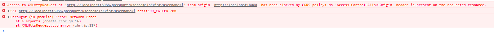

Java

<!--more-->

## mybatis

### 1.mybatis逆向生成工具

mybatis通用生成工具

maven依赖

```XML
<!-- 通用mapper逆向工具 -->
        <dependency>
            <groupId>tk.mybatis</groupId>
            <artifactId>mapper-spring-boot-starter</artifactId>
            <version>2.1.5</version>
        </dependency>
```

可以借助mybatis逆序生成工具 生成pojo类 mapper文件

### 2.使用包下的类来简化查询

```JAVA
Example userExample = new Example(Users.class);
Example.Criteria userCriteria = userExample.createCriteria();
userCriteria.andEqualTo("username", username);
Users result = usersMapper.selectOneByExample(userExample);
```

### 3.数据脱敏

```java
MD5Utils.getMD5(password);
```

> 将密码通过md5加密存入数据库
>
> 登陆时,将用户输入的密码进行MD5加密,与数据库中的值进行比较

### 4.mybatis分页插件

> 原生分页
>
> 按价格排序
>
> 第一页按价格升序,之后第二页价格排序的结果和之前那一页商品价格没有完全对应上
>
> 前一页和后一页的商品价格没有对应上

### 5.分页插件的bug

> mybatis-pagehelper 分页插件不支持嵌套结果映射
>
> 由于嵌套结果方式会导致结果集被折叠,因此分页查询的结果在折叠后总数会减少,所以无法保证分页结果数量正确

1.解决

	>查询所有id之后,将pageSize个数的 id 传递给后端,由后端查询数据,返回给前端

 2.解决

> mybatis自己内部解决,嵌套
>
> 将一整个sql 进行拆分,拆分为多个sql进行查询
>
> 修改mapper.xml文件中的sql语句


> 在 OrdersMapperCustom.xml 中有第2种解决方案


### 6.模糊查询

```sql
/*mapper.xml文件中要这样写*/

<if test="paramsMap.keywords != null">
                and i.item_name like '%${paramsMap.keywords}$%'
</if>
```

mapper.xml 多条件查询

```XML
		order by
        <!--k: 默认,代表默认排序,根据name 
        c: 根据销量排序
        p: 根据价格排序
        -->
	&quot; &quot; 
	< 转义'' 符号 , 有可能报错/>
		<choose>
                
          <when test="paramsMap.sort == &quot;c&quot;">
              i.sell_counts desc
          </when>
             <when test="paramsMap.sort == &quot;p&quot;">
                tempSpec.priceDiscount asc
           </when>
           <otherwise>
               i.item_name asc
           </otherwise>
     </choose>
	<!--
      <choose>
                
          <when test="paramsMap.sort == 'c'">
              i.sell_counts desc
          </when>
             <when test="paramsMap.sort == 'p'">
                tempSpec.priceDiscount asc
           </when>
           <otherwise>
               i.item_name asc
           </otherwise>
     </choose> -->
```


### 7. xml文件 " 号的转义

> xml文件中 "" 转义

```XML
<when test="paramsMap.sort == &quot;c&quot;">
    i.sell_counts desc
</when>
```

> 这样写会报错
>
> java.lang.NumberFormatException: For input string: "k"


```XML
<when test="paramsMap.sort == 'c' ">
    i.sell_counts desc
</when>
```

> 模糊查询时的书写 用$符号取值 而不是 # 号

```XML
<if test="paramsMap.keywords != null and paramsMap.keywords != '' ">
   and i.item_name like '%${paramsMap.keywords}%'
</if>
```


> mybatis-pagehelper

1. 引入分页插件依赖

	```XML
	<!--mybatis-pagehelper 实现分页 -->
	<dependency>
	<groupId>com.github.pagehelper</groupId>
	<artifactId>pagehelper-spring-boot-starter</artifactId>
	<version>1.2.12</version>
	</dependency>
	```

2. 配置application.yml配置文件

	```YML
	pagehelper:
		helperDialect: mysql
		supportMethodsArguments: true
	```

3. 用分页插件，在查询前使用分页插件，原理：统一拦截sql，为其提供分页功能

	```JAVA
	/**
	* page: 第几页
	* pageSize: 每页显示条数
	*/
	PageHelper.startPage(page, pageSize);
	```

4. 页数据封装到 PagedGridResult.java 传给前端

	```JAVA
	PageInfo<?> pageList = new PageInfo<>(list);
	PagedGridResult grid = new PagedGridResult();
	grid.setPage(page);
	grid.setRows(list);
	grid.setTotal(pageList.getPages());
	grid.setRecords(pageList.getTotal());
	```

	


## 跨域



前端端口 8080 到 后端端口8088 不一致 , 会产生跨域问题 ,

写一个配置类 注册到spring

```java
package com.tho.config;


import org.springframework.context.annotation.Bean;
import org.springframework.context.annotation.Configuration;
import org.springframework.web.cors.CorsConfiguration;
import org.springframework.web.cors.UrlBasedCorsConfigurationSource;
import org.springframework.web.filter.CorsFilter;

// 配置跨域问题
@Configuration
public class CorsConfig {

    public CorsConfig() {

    }
    /**
    * @Author tho
    * @Date 2021/10/29 23:28
    * @param
    * @Return CorsFilter
    * @Description: 配置跨域
    */
    @Bean
    public CorsFilter corsFilter() {
        // 1.添加cors配置信息
        CorsConfiguration config = new CorsConfiguration();

        config.addAllowedOrigin("http://localhost:8080");

        // 设置是否发送 cookie信息
        config.setAllowCredentials(true);

        // 设置允许请求的方式
        config.addAllowedMethod("*");

        // 设置允许的header
        config.addAllowedHeader("*");

        // 2.为url添加映射路径
        UrlBasedCorsConfigurationSource corsSource = new UrlBasedCorsConfigurationSource();
        corsSource.registerCorsConfiguration ("/**", config);

        // 3.返回重新定义好的corsSource
        return new CorsFilter(corsSource);

    }
}
```

## cookie&session

> cookie 
>
> - 以键值对的形式存储信息在浏览器
>
> - cookie不能跨域,当前及其父级域名可以取值
> - cookie可以设置有效期
> - cookie可以设置path

> session
>
> - 基于服务器内存的缓存(非持久化),可保持请求会话
> - 每个session通过sessionid来区分不同请求
> - session可以设置过期时间
> - session也是以键值对存在的

## springboot配置日志

依赖

- springboot-starter 和 springboot-web都要屏蔽自带的日志框架

```XML
<dependency>
            <groupId>org.springframework.boot</groupId>
            <artifactId>spring-boot-starter</artifactId>
            <!--使用自定义日志框架 屏蔽自带的日志框架-->
            <exclusions>
                <exclusion>
                    <groupId>org.springframework.boot</groupId>
                    <artifactId>spring-boot-starter-logging</artifactId>
                </exclusion>
            </exclusions>
        </dependency>
        <dependency>
            <groupId>org.springframework.boot</groupId>
            <artifactId>spring-boot-starter-web</artifactId>
            <!--使用自定义日志框架 屏蔽自带的日志框架-->
            <exclusions>
                <exclusion>
                    <groupId>org.springframework.boot</groupId>
                    <artifactId>spring-boot-starter-logging</artifactId>
                </exclusion>
            </exclusions>
            <!-- 打包war [2] 移除自带内置tomcat -->
            <!--<exclusions>
                <exclusion>
                    <artifactId>spring-boot-starter-tomcat</artifactId>
                    <groupId>org.springframework.boot</groupId>
                </exclusion>
            </exclusions>-->
        </dependency>
```

- 为slf4j添加配置文件

log4j.properties

```properties
log4j.rootLogger=DEBUG,stdout,file
log4j.additivity.org.apache=true
log4j.appender.stdout=org.apache.log4j.ConsoleAppender
log4j.appender.stdout.threshold=INFO
log4j.appender.stdout.layout=org.apache.log4j.PatternLayout
log4j.appender.stdout.layout.ConversionPattern=%-5p %c{1}:%L - %m%n
log4j.appender.file=org.apache.log4j.DailyRollingFileAppender
log4j.appender.file.layout=org.apache.log4j.PatternLayout
log4j.appender.file.DatePattern='.'yyyy-MM-dd-HH-mm
log4j.appender.file.layout.ConversionPattern=%d{yyyy-MM-dd HH:mm:ss} %-5p %c{1}:%L - %m%n
log4j.appender.file.Threshold=INFO
log4j.appender.file.append=true
log4j.appender.file.File=/workspaces/logs/foodie-api/mylog.log
```


## BaseController

> 定义分页中每页显示数据的大小
>
> 其它Controller继承BaseController即可


## 涉及到金额

> 使用分为单位 9.98元   998分
>
> int类型


## sql语句

```sql
`` 和 '' 使用
varchar类型变量的使用
```


## Git使用


## 购物车功能

1. 购物车存储形式 - Cookie
	- 无需登录,无需查库,保存在浏览器端
	- 优点：性能好,访问快,没有和数据库交互
	- 缺点1：换电脑购物车数据会丢失
	- 缺点2：电脑被其他人登录,不安全
2. 购物车存储形式-Session
	- 用户登录后,购物车数据放入用户会话
	- 优点：初期性能较好,访问快
	- 缺点1：session基于内存,用户量庞大影响服务器性能
	- 缺点2：只能存在当前会话,不适用集群与分布式系统
3. 购物车存储形式-数据库
	- 用户登录后,购物车数据存入数据库
	- 优点：数据持久化，可在任何地点任何时间访问
	- 缺点：频繁读写数据库,造成数据库压力
4. 购物车存储形式 - Redis
	- 用户登录后，购物车数据存入redis缓存
	- 优点1：数据持久化，可在任何地点任何时间访问
	- 优点2：频繁读写基于缓存,不会造成数据库压力
	- 优点3：适合使用集群和分布式系统,可扩展性强 

## 正则表达式

校验手机号

```JAVA
public static boolean checkMobileIsOk(String mobile) {
        String regex = "^((13[0-9])|(14[5|7])|(15([0-3]|[5-9]))|(17[013678])|(18[0,5-9]))\\d{8}$";
        Pattern p = Pattern.compile(regex);
        Matcher m = p.matcher(mobile);
        boolean isMatch = m.matches();
        return isMatch;
}
```


## 调用微信支付中心回调接口


> 同步通知 , 异步通知

> 生成订单 -> 请求支付中心,此时支付页面会轮询订单状态,如果支付成功,支付中心会回调本地接口,将订单状态修改,支付页面会根据订单状态进行跳转,跳转到支付成功页面
>
> 想要让远程支付中心回调本地接口,需要进行内网穿透,使得本地接口可以被远程支付中心调用,或者将项目部署到云服务器
>
> (可以之间修改数据库订单状态来模拟完成订单支付)
>
> 微信支付方式前端页面可以根据支付中心返回支付金额来得到具体的支付金额
>
> 支付宝支付 无法之间根据支付中心返回的支付金额来显示,只能显示购物车显示的支付金额
>
> (修改了支付成功页面,不管哪一种支付方式,最后的支付结果都是0.01元)


## @ComponentScan注解

```java
(basePackages = {"com.tho", "org.n3r.idworker"})


import org.n3r.idworker.Sid; 导入的Sid
使用 
  @Autowired
  private Sid sid; 
是无法使用sid中的方法的,需要加上最上面的注解到 启动类 (Application.class) 才能使用
```


## 定时任务

>* 使用定时任务关闭超期未支付订单,会存在的弊端:
>* 1.会有时间差,程序不严谨
>*   10.39 下单 11.00 检查 不足 1小时 , 12:00 检查,超过1小时多余 21 分钟
>* 2.不支持集群
>*   单机没有问题,使用集群后,就会有多个定时任务
>*   解决方案:只使用一台计算机节点,单独用来运行所有定时任务
>* 3.会对数据库全表搜索,影响数据库性能 : select * from order_status
>
>* 定时任务,仅仅只适用于小型轻量级项目,传统项目
>
>* 消息队列 MQ 来 解决定时任务的需求
>  * 延时任务(队列)
>  * 10:12 下单的,未付款订单 , 11:12分检查,如果当前状态还是10, 则直接关闭订单即可


## Sql语句

查询名字重复的数据

删除名字重复的数据


## 参数校验

### Hibernate Validator校验参数

https://www.jianshu.com/p/a1e8a8908ec1

#### 1.实体类上加上相关注解,标识参数校验的规则

```JAVA
package com.tho.pojo.bo.center;

import io.swagger.annotations.ApiModel;
import io.swagger.annotations.ApiModelProperty;
import lombok.Data;
import org.hibernate.validator.constraints.Length;

import javax.validation.constraints.*;
import java.util.Date;

@Data
@ApiModel(value="用户对象", description="从客户端，由用户传入的数据封装在此entity中")
public class CenterUserBO {

    @ApiModelProperty(value="用户名", name="username", example="json", required = false)
    private String username;
    @ApiModelProperty(value="密码", name="password", example="123456", required = false)
    private String password;
    @ApiModelProperty(value="确认密码", name="confirmPassword", example="123456", required = false)
    private String confirmPassword;


    @NotBlank(message = "用户昵称不能为空")
    @Length(max = 12, message = "用户昵称不能超过12位")
    @ApiModelProperty(value="用户昵称", name="nickname", example="杰森", required = false)
    private String nickname;

    @Length(max = 12, message = "用户真实姓名不能超过12位")
    @ApiModelProperty(value="真实姓名", name="realname", example="杰森", required = false)
    private String realname;

    @Pattern(regexp = "^(((13[0-9]{1})|(15[0-9]{1})|(18[0-9]{1}))+\\d{8})$", message = "手机号格式不正确")
    @ApiModelProperty(value="手机号", name="mobile", example="13999999999", required = false)
    private String mobile;

    @Email
    @ApiModelProperty(value="邮箱地址", name="email", example="imooc@imooc.com", required = false)
    private String email;

    @Min(value = 0, message = "性别选择不正确")
    @Max(value = 2, message = "性别选择不正确")
    @ApiModelProperty(value="性别", name="sex", example="0:女 1:男 2:保密", required = false)
    private Integer sex;
    @ApiModelProperty(value="生日", name="birthday", example="1900-01-01", required = false)
    private Date birthday;
}
```

#### 2.Controller中加入相关注解

>@Valid 加到 @RequestBody 注解的实体类
>
> 加上 BindingResult result 参数
>
>getErrors 方法获取 错误信息
>
>判断BindingResult是否保存错误的校验信息,如果有,直接return
>        if (result.hasErrors()) {
>            Map<String, String> errors = getErrors(result);
>            return CommonJsonResult.errorMap(errors);
>        }
>
>前端做好错误信息提示

```JAVA
@ApiOperation(value = "获取用户信息", notes = "获取用户信息", httpMethod = "Post ")
    @PostMapping("/update")
    public CommonJsonResult update(
            @ApiParam(name = "userId", value = "用户id", required = true)
            @RequestParam String userId,
            @RequestBody  @Valid CenterUserBO centerUserBO,
            BindingResult result,
            HttpServletRequest request,
            HttpServletResponse response) {
        // 判断BindingResult是否保存错误的校验信息,如果有,直接return
        if (result.hasErrors()) {
            Map<String, String> errors = getErrors(result);
            return CommonJsonResult.errorMap(errors);
        }


        Users userResult = centerUserService.updateUserInfo(userId, centerUserBO);
        Users users1 = setNullPropertyValue(userResult);
        // 设置cookie
        CookieUtils.setCookie(request, response, "user",
                JsonUtils.objectToJson(users1), true);


        // todo 后续要改,要增加令牌token,会整合进redis,分布式会话
        return CommonJsonResult.ok();
    }
    /**
    * @Author tho
    * @Date 2021/11/6 15:54
    * @param result
    * @Return Map<String,String>
    * @Description: 获取hibernate.validator 校验的错误
    */
    private Map<String, String> getErrors(BindingResult result) {
        HashMap<String, String> map = new HashMap<>();
        List<FieldError> errorList = result.getFieldErrors();
        for (FieldError error : errorList) {
            String errorField = error.getField();
            String errorMsg = error.getDefaultMessage();
            map.put(errorField, errorMsg);
        }
        return map;

    }
```


## 商家发货需要通过浏览器发起请求

>添加一个按钮,进行商家发货