MySQL基础

<!--more-->

# 一、mysql概述

## 1.1、mysql环境搭建

> 下载mysql压缩包
>
> 解压到目录下
>
> 配置环境变量
>
> 新建修改mysql配置文件 my.ini
>
> 管理员模式打开cmd，安装mysql服务
>
> 初始化加载mysql配置文件
>
> 启动mysql，用命令进入mysql管理界面，修改密码
>
> 修改mysql配置文件，开启密码验证，刷新权限
>
> 重启mysql服务 `net stop mysql/net start mysql`
>
> 正常使用

## 1.2、Sqlyog使用

## 1.3、常用命令

> 命令行连接

```SQl
mysql -u root -p 123456   -- 连接数据库
update mysql.user set authentication_string=password("zqm@mysql") where user='root' and Host = 'localhost'; -- 修改root用户密码
flush privileges; -- 刷新权限
-- 所有语句都使用 ; 结尾
show databases; -- 查看所有的数据库
use school --切换数据库 use 数据库名

show tables --查看数据库中所有的表
describe student; -- 显示数据库中所有表的信息

create databases mybatis; -- 创建一个名为 mybatis 的 数据库

exit; --退出连接

-- 单行注释(sql本来的注释)

/*
		多行注释
*/
```

- DDL    数据库定义语言
- DML   数据库操作语言
- DQL   数据库查询语言
- DCL   数据库控制语言

# 二、操作数据库

操作数据库->操作数据库中的表->操作数据库中表的数据

- mysql不区分大小写

## 2.1、数据库操作(了解)

1、创建数据库

`create database [if not exist] mybatis;` 创建数据库，[如果不存在]

2、删除数据库

`drop databse [if exists] mybatis;` 删除数据库

3、使用数据库

```SQL
-- 如果表名或者字段名是一个特殊字符需要带 ``
use `school`; -- 使用数据库
```

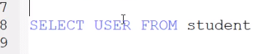

- 加 `` 标识一些字段

	​	

4、查看数据库

`show databases;` - 查看所有的数据库

## 2.2、数据库的列类型

> 数值

- tinyint   十分小的数据 1 个字节
- smallint  较小的数据   2个字节
- mediumint  中等大小的数据 3个字节
- ==int        标准的整数     4个字节==
- bigint   较大的数据    8个字节


- float    单精度浮点数 4个字节
- double  双精度浮点数 8个字节 (精度问题)
- ==decimal   字符串形式的浮点数    金融计算的时候，一般是使用decimal==

> 字符串

- char 固定大小的字符串  0~255
- ==varchar 可变长字符串    0~65535==  常用
- tinytext  微型文本  2^8-1
- text      大文本       2^16 - 1

> 时间日期

java.util.Date - java中的类

- date   		YYYY-MM-DD，日期格式
- time           HH:mm:ss，时间格式
- ==datetime    YYYY-MM-DD  HH:mm:ss  最常用的时间格式==
- ==timestamp  时间戳 1970.1.1 到现在的毫秒数  也较为常用==
- year   年份表示

> null

- 没有值，未知
- ==注意：不要使用null值进行计算 ，结果都为null==

## 2.3、数据库的字段属性(重点)

==Unsigned：==

- 无符号的整数
- 声明了该列不能声明为负数

==zerofill：==

- 零填充 不足的位数使用0来填充  int(3) 写了一个 5 会变成 005

==自增==

- 通常理解为自增，自动在上一条记录的基础上+1(默认)
- 通常用来设计唯一的主键~index，必须是整数类型
- 可以自定义设计主键自增的起始值和步长

==非空 NULL NOT NULL==

- 假设设置为非空，如果不给他赋值，就会报错
- null ， 如果不填写值，默认就是null

==默认==

- 设置默认的值
- sex，默认值为男，如果不指定该列的值，会有默认值填充


==注意- 拓展==

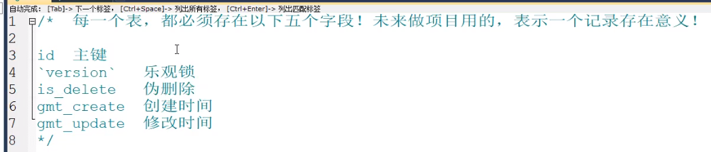

## 2.4、创建数据库表

```SQL
-- 注意点  使用 英文 () , 表的名称和字段 尽量使用 `` 括起来
-- AUTO_INCREMENT 自增
-- 所有的语句后面加  , 英文的 ， 最后一个字段不用加
-- PRIMARY KEY 主键  主键 一般一个表只有一个唯一的
create table if not exists `student`(
	`id` INT(4) NOT NULL AUTO_INCREMENT COMMENT '学生id',
  `name` VARCHAR(30) NOT NULL DAFAULT '匿名' COMMENT '姓名',
  `password` VARCHAR(20) NOT NULL DEFAULT '123456' COMMENT '密码',
  `sex` VARCHAR(2) NOT NULL DEFAULT '女' COMMENT '性别',
  `birthday` DATETIME DEFAULT NULL COMMENT '出生日期',
  `address` VARCHAR(100) DEFAULT NULL COMMENT '家庭住址',
  `email` VARCHAR(50) DEFAULT NULL COMMENT '邮箱',
  PRIMARY KEY(`id`)
)ENGINE=INNODB DEFAULT CHARSET=utf8
```

> 大概的格式

```SQL
CREATE TABLE[IF NOT EXISTS] `表名`(
	`字段名` 列类型 [属性] [索引] [注释],
  `字段名` 列类型 [属性] [索引] [注释],
  `字段名` 列类型 [属性] [索引] [注释],
  PRIMARY KEY(`字段名`)
)engine=数据库引擎 DEFAULT CHARSET=utf8
```

> 查看表或数据库的创建语句

```SQL
show create database school --查看创建数据库的语句
show create table student --查看创建表的语句
DESC student -- 显示表的结构
```

## 2.5、数据表的类型

```SQL
-- 关于数据库引擎
/*
INNODB   默认使用的
MYISAM   早些年使用的
*/
```

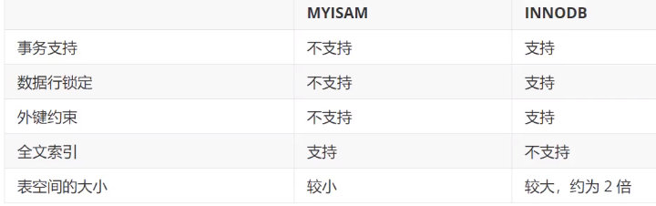

- MYISAM  节约空间，速度较快

- INNODB   安全性高，事务的处理，多表用户操作

> 在物理空间存在的位置

所有的数据库文件都存在data目录下，一个文件夹就对应一个数据库

本质还是文件的存储！

Mysql数据库引擎在物理文件上的区别

- InnoDB 在数据库表中只有一个*.frm 文件 ， 以及上级目录下的 ibdata1 文件
- Myisam 对应的物理文件
	- *.frm 	 表结构的定义文件
	- *.MYD    数据文件(data)
	- *.MYI      索引文件 (index)

> 设置数据库的字符集编码

```SQL
CHARSET = utf8
```

不设置的话，会是mysql默认的字符集编码(不支持中文)


1. 在my.ini中配置默认的编码 `character-set-server=utf8`
2. 

## 2.6、表的操作

修改和删除数据表字段

> 修改表字段

```SQL
alter table teacher rename as teacher1 --修改表名称
alter table 表名 rename as 新表名
--修改表字段
-- change用来字段重命名
-- modify 用来修改字段约束
alter table teacher1 add age INT(11) -- 修改表字段
alter table teacher1 modify age varchar(10) --修改约束
alter table teacher1 change age age1 --修改列名，字段重命名

alter table teacher1 drop age1 -- 删除表字段
-- 删除表
drop table if exists teacher1 
-- 所有的操作尽量加上判断，以免报错
```

==注意点==

- 字段名 用 ``包裹
- 注释  -- /**/
- mysql关键字大小写不敏感 ， 建议小写  容易看出，所有的符号全部用英文，分号;

# 三、mysql数据管理

## 3.1、数据库级别的外键(了解即可)

==阿里Java规范：[强制]不可以使用外键或级联，一切外键必须在应用层解决==

> 方式一，创建表的时候，增加约束，比较复杂
>
> 删除有外键关系表的时候，必须先删除引用了别的表的表(从表)，才能删除被引用的表(主表)


> 方式二、创建表成功后，添加外键约束
>
> sql语句给表增加外键

```SQL
alter table `student` 
add constraint `FK_gredeid` FOREIGN KEY(`gradeid`) REFERENCES `grade` (`gradeid`);
```


==以上操作都是物理外键，数据库级别的外键，不建议使用(避免数据库依赖过多，造成困扰)==

==最佳实践，避免使用外键==

- 数据库就是单纯的表，只用来存数据，只有行(数据)和列(字段)
- 使用外键，程序去实现

## 3.2、DML语句(全部记住)

**数据库意义**：数据存储，数据管理

DML语言：数据操作语言

- Insert 插入
- Update 插入
- Delete 删除

## 3.3、添加

> insert

```SQL
insert into `grade` (`username`) values ('张三')
-- 如果不写指定的字段，会按照顺序一一匹配
insert into `grade` values '张三'
--写插入语句，保证数据和字段一致
--插入多行数据
insert into `grade` (`username`) values('张三'),('王五')
```

> 语法
>
> 插入多行数据
>
> `insert into 表名([字段名1],[字段名2],[字段名3]) values('值1'),('值2'),('值3')` 
>
> 插入单行数据
>
> `insert into 表名([字段名1],[字段名2],[字段名3]) values('值1','值2','值3')` 

注意事项：

- 字段和字段之间使用英文逗号隔开
- 字段是可以省略的，但后面的值要一一对应
- 可以同时插入多行数据

## 3.4、修改

> update  修改谁 条件 set 原来的值 新值

```SQL
-- 修改在student表中id为1的记录，把名字修改为张三
update `student` set `name` = '张三' where id = 1;
-- 不指定条件的情况下修改会修改整个表的记录
update `student` set `name` = '张三'

-- 语法
update 表名 set 字段名 = 值 where 搜索记录的条件
-- 多个属性的记录修改
update `student` set `name` = '张三',`email` = '12@qq.com' where id = 1;
-- 多个条件确定要修改的记录
update `student` set `name` = '张三' where id = 1 and calss = '大一'
```

> 条件 where子句  运算符 

```SQL
-- id大于某个值，等于某个值 在某个区间内修改

```

> 常用操作符

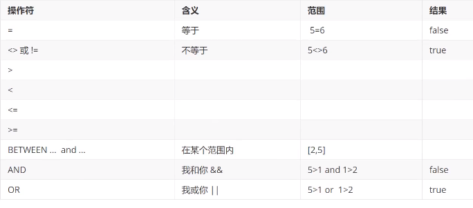

==语法：`update 表名 set colnum_name = value,[colnum_name=value,...] where [条件]`==

==注意==

- colnum_name 是数据库的列(属性字段)，尽量加上``

- 条件，筛选的条件，如果没有指定条件，会修改所有的列

- value，是一个具体的值，也可以是一个变量，多个设置的属性之间用英文逗号隔开

	```sql
	update `student` set `date`=CURRENT_TIME where name = '张三' and sex = '男';
	```

	

## 3.5、删除

> delete

```SQL
-- 删除指定数据
delete from 表名 [where 条件]
delete from `student` where id = 1;
```

> TRUNCATE 命令

作用：完全清空一个数据表，表的结构和索引约束不会变！

```SQL
-- 清空 student 表
truncate `student`
```

> truncate和delete区别

- 相同点：都能删除数据，都不会删除表结构
- 不同点：
	- truncate 重新设置自增列 计数器归零
	- truncate 不会影响事务
- 了解即可
	- InnoDB 自增列会从1开始(存在内存中，断电即失)
	- Myisam 继续从上一个自增量开始，(存在文件中的，不会丢失)

# 四、DQL查询语句(最重要)

==select完整语法==

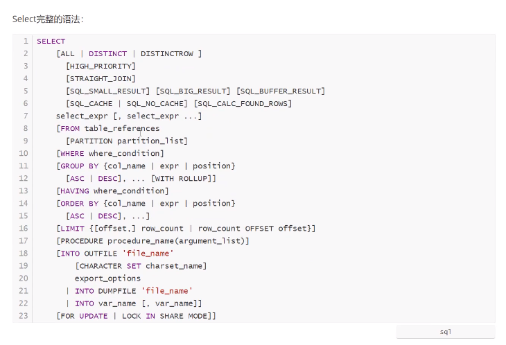

## 4.1、DQL

Data Query Language ： 数据查询语言

- 所有的查询操作都要用它 Select
- 简单的查询，复杂的查询它都能做
- 数据库中最核心的语言，最重要的语句
- 使用频率最高的语句

```SQL
-- 查询所有信息 在 表  student
select * from student
-- 查询指定字段的信息
select `name`,`age` from student
-- 别名 给字段起一个别名 as 也可以给表起别名
select `name` as 名字 , `age` as 年龄 from student
-- 函数 concat(a,b)
SELECT CONCAT ('ID：',`userId`) AS NewID FROM grade AS s
```

语法：

```SQL
select 字段 ... from 表
```

> 有的时候，字段的名字不是很能见名知意，起别名来进行改善这种情况
>
> 字段名 as 别名 

## 4.2、去重  distinct

> 作用：去除select查询出来的结果中的重复数据，重复的数据只显示一条

```SQL
-- 查询有哪些同学参加了考试，成绩
select * from result 
-- 查询有哪些同学参加了考试 去重
select `id` from result
-- 发现重复数据，去重
select distinct `id` from result

```

> 数据库的列 (表达式)

```SQL
SELECT VERSION() -- 查询系统版本(函数)
SELECT 100*3 AS 计算 -- 计算(表达式)
SELECT @@auto_increment_increment -- 查询自增的步长(变量)
```

> 数据库表中某一字段集中查询出来后修改

```SQL
-- 数据库中所有字段全部 +1 只限查询时，数据库中的数据并不会修改
SELECT DISTINCT `userId`+1 FROM grade
```

==数据库中的表达式：文本值，列，null，函数，计算表达式，系统变量==

## 4.3、where条件子句

- 检索数据中==符合条件==的值

- 搜索的条件由一个或者多个表达式组成！
- 结果是 布尔值

### 1、逻辑运算符

> 逻辑运算符  与 或 非


==尽量使用英文字母==

> 代码测试

```SQL
-- ==============where=============
select `studentNo`,`StudentResult` from result

-- 查询成绩在95-100 之间的学生成绩
select `studentNo`,`studentResult` from result 
	where studentResult >=90 and StudentResult <=100
-- and && 等价 但尽量使用 and 意思比较清晰
select `studentNo`,`studentResult` from result 
	where studentResult >=90 && StudentResult <=100

-- 模糊查询 (区间) between and 区间范围 [95,100] between 95 and 100
select `studentNo`,`studentResult` from result 
	where studentResult between 95 and 100 
-- 查询除了1000号学生之外的同学的成绩
select `studentNo`,`studentResult` from result 
	where studentNo != 1000
-- != not
select `studentNo`,`studentResult` from result 
	where not studentNo = 1000

```

### 2、比较运算符

> 模糊查询：比较运算符

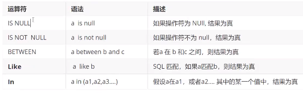

> 代码实现

```SQL
-- =============模糊查询==================
-- ===============like=================== 
-- like结合 %(代表0到任意个字符)  _(一个字符)
-- 查询姓刘的同学 
select `StudentNo`,`StudentName` from `student` 
	where StudentName like '刘%'
-- 查询姓刘的查询，名 只有一个字
select `StudentNo`,`StudentName` from `student` 
	where StudentName like '刘_'
-- ==============in (具体的某一个或多个值)================
-- 查询1001，1002，1003 号 学员
select `StudentNo`,`StudentName` from `student` 
 where StudentNo in(1001,1002,1003)
-- 查询在北京的学生
select `StudentNo`,`StudentName` from `student` 
	where `Address` in('北京')
-- =============null 和 not null ============
-- 查询地址为空的学生 null ''
select `StudentNo`,`StudentName` from `student` 
	where address ='' or address IS NULL
-- 查询有出生日期的同学    出生日期 - 不为空
select `StudentNo`,`StudentName` from `student` 
 where `BornDate` IS NOT NULL
 -- 查询没有出生日期的同学，出生日期 - 为空
 select `StudentNo`,`StudentName` from `student`
 	where `BornDate` IS NULL
```

## 4.4、联表查询(重要)

### 1、连接查询 join on

> Join 对比


> 七种Join

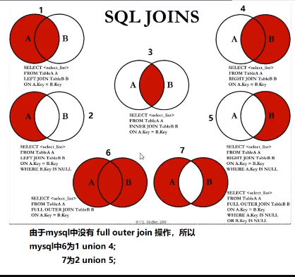


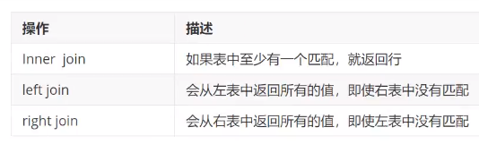

> 代码

```SQL
-- 查询参见了考试的同学(学号，姓名，科目编号，分数)
select * from student
select * from result
-- 思路
-- 1.分析需求，分析查询的字段来自哪些表，(连接查询)
-- 2.确定使用哪种连接查询？7种
-- 确定交差点，(两个表中哪个数据是相同的)
-- 判断的条件：student表中的 no = result表中的no
select s.studentNo,studentName,subjectNo
from stduent s
inner join result r
where s.studentNo = r.studentNo 
-- join on (判断的条件) 连接查询
-- where (连接的表) 等值查询

-- 思路
-- 要查询哪些数据 select...
-- 从哪几个表中查， from 表， xxx join 连接的表 on 	交叉条件
-- 假设存在多张表查询，先查询两张表，再慢慢增加

-- from a left join b   (A表为基准)
-- from a right join b (B表为基准)
```

### 2、自连接(了解)

> 自己的表和自己的表连接， ==一张表拆成两张一样的表==

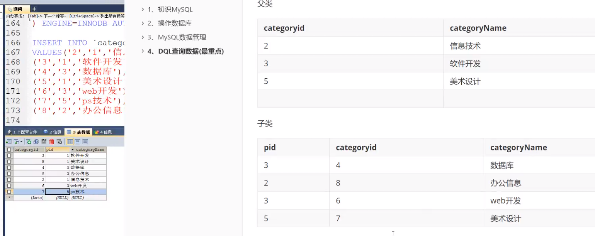

操作：查询父类对应的子类关系

```SQL
-- 	查询父子信息，把一张表看作两张一模一样的表
-- a 作为 父表  b 作为子表 但两个表其实是一个表
select a.`categoryName` as '父栏目' b.`category` as '子栏目'
from `category` as a,`category` as b
where a.`categoryid`=b.`pid`
```

## 4.5、分页和排序

> order by 和 limit 有先后顺序

```sql
select * from `grade`
order by score
```

## 4.6、子查询和嵌套查询

where(值是固定的，这个值是计算出来的)

本质：`在where语句中嵌套一个查询语句`

## 4.7、select小结

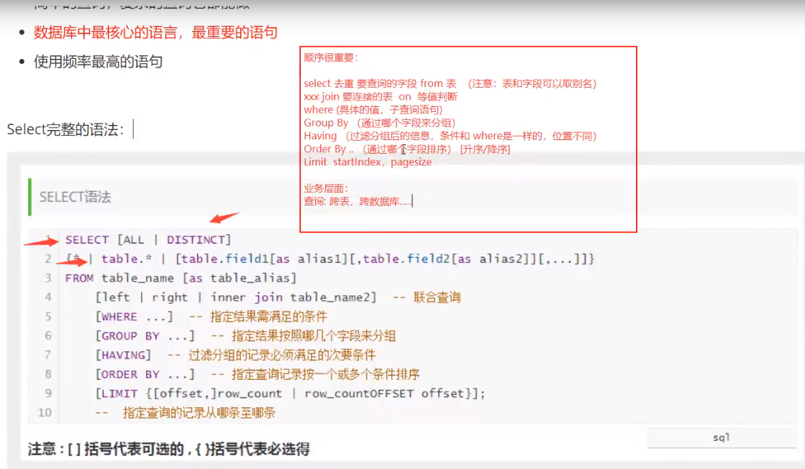


# 五、Mysql函数

## 5.1、常用函数

```SQL
-- 数学运算
select ABS() --绝对值
select CEILING() --向上取整
select FLOOR() -- 向下取整
select rand() -- 随机数
select sign() --判断数的符号， 0 - 0 负数返回 -1 正数返回 1
-- 字符串函数
select CHAR_LENGTH() --字符串长度
select concat('A','B','C') --字符串拼接
select lower() -- 英文字母全部转换为小写
select upper() -- 英文字母全部转换为大写
select substr() --截取字符串 (str,起始位置,截取数量)
select reverse() --反转字符串
```

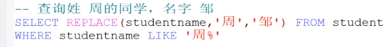

``` sql
-- 时间和日期函数
select current_date() --获取当前日期
select curdate()  	  --获取当前日期
select now()          --获取当前的时间
select localtime()    --获取当前时间
select sysdate()      --获取系统时间
-- 系统函数
select SYSTEM_USER() --获取当前用户
select USER()        --获取当前用户
select version()     --获取数据库版本
```


## 5.2、聚合函数(常用)

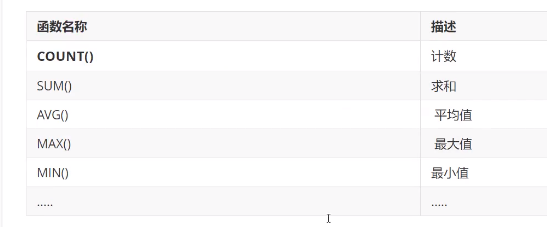

```SQL
-- 聚合函数
-- 都能统计表中的数据 (想查询一个表中有多少个记录) 使用 count()
select count(`字段名`) from student -- Count(字段名) ，会忽略所有的null值
select count(*) from student --count(*)，不会忽略null值
select count(1) from student --count(1)，不会忽略null值

select sum(`result`) as '总和' from result -- 总和
select avg(`result`) as '平均分' from result -- 均值
select max(`result`) as '最高分' from result  --最大值
select min(`result`) as '最低分' from result  --最小值


```

## 5.3、MD5加密

> 主要增强算法复杂度和不可逆性	
>
> 具体的值的 md5 是一样的
>
> MD5破解网站的原理，背后有一个字典，MD5加密后的值，  加密前的值

> 使用md5加密
>
> 验证密码时，将输入的密码进行md5算法加密，再与数据库中的密码字段相比较，得出结果

```SQL
-- 加密
update testmd5 set password = MD5(password) where id = 1
update testmd5 set password = MD5(password) -- 加密全部的密码	 
-- 插入的时候加密
insert into testmd5 values(3,'xiaohu',MD5('123456'))
-- 如何校验
-- 将用户传递进来的密码进行md5加密，比对加密后的值
```

# 六、事务

## 6.1、什么是事务

要么都成功，要么都失败 - 银行转账业务

> 事务原则：ACID原则，原子性，一致性，隔离性，持久性 (脏读，幻读)

博客：https://blog.csdn.net/dengjili/article/details/82468576

**原子性**： 要么都成功，要么都失败

**一致性**： 事务前后数据完整性要保持一致， 原先只有1000块，事务提交后，还是只有1000块

**持久性**： 事务一旦被提交，数据库中数据的改变就是永久的，数据库发生故障也不应该对其产生影响

**隔离性**： 多个用户并发访问数据库时，数据库为每一个用户开启事务，不能被其它事务的操作数据所干扰，多个并发事务之间要相互隔离 

> 隔离所导致的一些问题

**脏读** ：一个事务读取了另一个事务未提交的数据

**不可重复读**：在一个事务内读取表中某一行数据，多次读取结果不同，(这个不一定是错误，只是某些场合不对)

**虚读(幻读)**：是指一个事务内读取到了别的事务插入的数据，导致前后读取不一致

## 6.2、测试mysql事务

> mysql事务 默认开启自动提交

```SQL
set autocommit = 0 -- 关闭事务自动提交

-- 手动处理事务
-- 事务开启 
start transaction -- 标记一个事务的开始，从这个之后的sql都在同一个事务内 (一组事务)
insert xx
insert zz
insert yy
-- 提交事务
commit --(持久化,如果事务执行成功)
rollback --(回滚，如果事务执行失败)
-- 事务结束
set autocommit = 1 --开启事务自动提交

-- 设置一个事务的保存点
savepoint 
rollback to savepoint -- 回滚到保存点
release savepoint --删除保存点
```

# 七、索引

> Mysql官方对索引的定义为：**索引(index)是帮助Mysql高效获取数据的数据结构**。提取句子主干，就可以得到索引的本质：索引是数据结构

## 7.1、索引的分类

> 在一个表中，主键索引只能有一个，唯一索引可以有多个

- 主键索引 (primary key)
	- 唯一地标识，主键不可重复，只能有一个列作为主键
- 唯一索引 (unique key)
	- 避免重复的列出现，唯一索引可以重复，多个列都可标识为  唯一索引
- 常规索引 (key/index)
	- 默认的，index，key关键字来设置
- 全文索引 (fulltext)
	- 在特定的数据库引擎下才有，myisam
	- 快速定位数据

> 索引的使用  - 基础语法

```SQL
  -- 索引的使用
-- 1.在创建表的时候给字段增加索引
-- 2.创建完毕后，增加索引
-- 显示所有的索引信息
SHOW INDEX FROM `test`

-- 增加一个索引
ALTER TABLE `test` ADD FULLTEXT INDEX `name` (`name`)

-- 分析sql执行的状况
EXPLAIN SELECT * FROM test -- 常规索引，非全文索引
 
```

## 7.2、测试索引

博客：https://blog.csdn.net/wufuhuai/article/details/79631466

## 7.3、索引原则

- 索引不是越多越好
- 不要对经常变动的数据加索引
- 小数据量的表不需要加索引
- 索引一般加在常用来查询的字段上

> 索引的数据结构

Hash类型的索引

Btree innodb默认的数据结构

# 八、权限管理和备份

## 8.1、用户管理

博客：https://blog.csdn.net/weixin_43790276/article/details/102674936

## 8.2、mysql数据库备份

为什么要备份

- 保证重要的数据不丢失
- 数据转移

Mysql数据库备份的方式

- 直接拷贝物理文件
- 可视化工具中手动导出
- 使用命令行导出 mysqldump 命令行导出

> 使用sql命令 导出/导入mysql数据库  mysqldump 命令使用

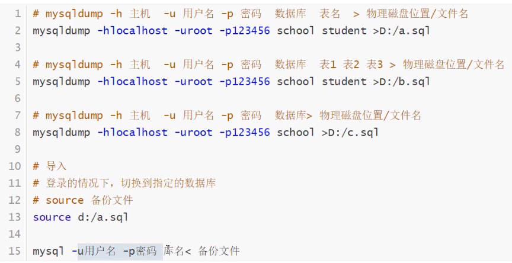

- 要备份数据库，防止数据丢失

# 九、规范数据库设计

## 9.1、为什么需要设计

==当数据库比较复杂的时候，我们就需要设计了==

**糟糕的数据库设计：**

- 数据冗余，浪费空间
- 数据库插入和删除都会麻烦，异常(屏蔽物理外键)
- 程序性能差

**良好的数据库设计：**

- 节省内存空间
- 保证数据的完整性
- 方便我们开发系统

**软件开发中，关于数据库的设计**

- 分析需求：分析业务和需要处理的数据库的需求
- 概要设计：设计关系图E-R图

**设计数据库的步骤**：(个人博客)

- 收集信息，分析需求
	- 用户表(用户登陆注销，用户个人信息，写博客，创建分类)
	- 分类表(文章分类，谁创建的)
	- 文章表(文章的信息)
	- 友链表(友链信息)
	- 自定义表(系统信息，某个关键字，或者一些主字段)  key:value
- 标识实体(把需求落地到每个字段)

## 9.2、三大范式

**为什么需要数据规范化**

- 信息重复
- 更新异常
- 插入异常
	- 无法正常显示信息
- 删除异常
	- 丢失有效信息

> 三大范式

博客：https://www.cnblogs.com/wsg25/p/9615100.html

**第一范式**

- 原子性：保证每一列不可再分

**第二范式**

- 前提：满足第一范式
- 且每张表只描述一件事情

**第三范式**

- 前提：满足第一，第二范式

- 数据表中每一列数据都和主键直接相关，而不能间接相关


规范数据库的设计

==规范性和性能的问题==

关联查询的表不得超过三张表

- 考虑商业化的需求和目标(成本，用户体验) 数据库性能更加重要
- 考虑性能同时还要适当地考虑规范性
- 故意给某些表增加一些冗余的字段。(从多表查询中变为单表查询)